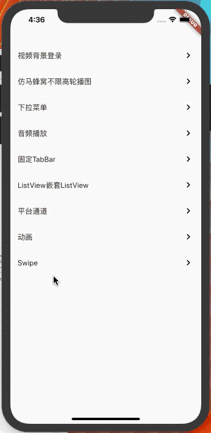

<h1 align="center">Flutter 小案例（flutter_widget）</h1>

## Flutter版本

```dart
Flutter 1.12.13+hotfix.9 • channel unknown • unknown source
Framework • revision f139b11009 (5 weeks ago) • 2020-03-30 13:57:30 -0700
Engine • revision af51afceb8
Tools • Dart 2.7.2

```

## 视频背景登录（IOS播放请使用真机调试）

<p align="center">
    
</p>

## 仿马蜂窝自适应高度轮播图

<p align="center">
    
</p>

## 自定义滑动（类似开言英语轮播图）
<p align="center">
    
</p>

## 错误信息

### 打包IOS程序报错

```bash
Warning: CocoaPods installed but not initialized. Skipping pod install.
  CocoaPods is used to retrieve the iOS and macOS platform side's plugin code that responds to your plugin usage on the Dart side.
  Without CocoaPods, plugins will not work on iOS or macOS.
  For more info, see https://flutter.dev/platform-plugins
To initialize CocoaPods, run:
  pod setup
once to finalize CocoaPods' installation.
```

### 运行`pod setup`

```bash
pod setup
```

