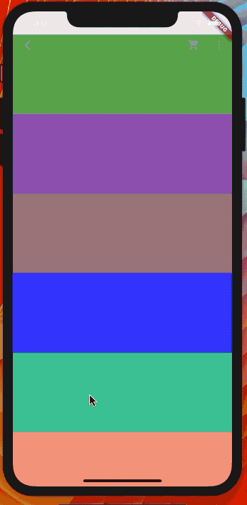
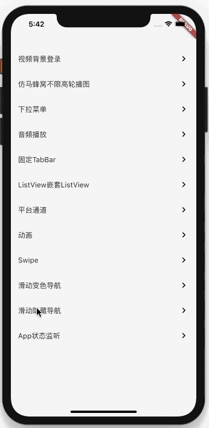
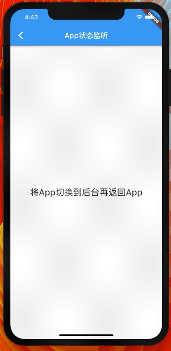

<h1 align="center">Flutter 小案例（flutter_widget）</h1>

## 扫码下载
<p align="center">
    
</p>
<h2 align="center">安装密码：123456</h2>

## Flutter版本（要注意版本比如1.12.13的版本跑iOS会报找不到引擎）

```dart
Flutter 1.17.0 • channel stable • https://github.com/flutter/flutter.git
Framework • revision e6b34c2b5c (7 days ago) • 2020-05-02 11:39:18 -0700
Engine • revision 540786dd51
Tools • Dart 2.8.1

```

## 视频背景登录（IOS播放请使用真机调试）

<p align="center">
    
</p>

## 仿马蜂窝自适应高度轮播图

<p align="center">
    
</p>

## 自定义滑动（类似开言英语轮播图）
<p align="center">
    
</p>

## 滑动导航变色
<p align="center">
    
</p>

## 滑动隐藏导航
<p align="center">
    
</p>

## App状态监听
<p align="center">
    
</p>

## 错误信息

### 打包IOS程序报错

```bash
Warning: CocoaPods installed but not initialized. Skipping pod install.
  CocoaPods is used to retrieve the iOS and macOS platform side's plugin code that responds to your plugin usage on the Dart side.
  Without CocoaPods, plugins will not work on iOS or macOS.
  For more info, see https://flutter.dev/platform-plugins
To initialize CocoaPods, run:
  pod setup
once to finalize CocoaPods' installation.
```

### 运行`pod setup`

```bash
pod setup
```

